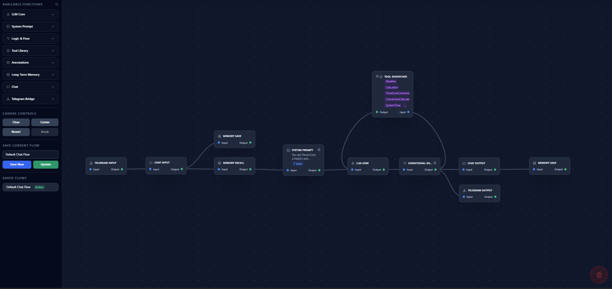
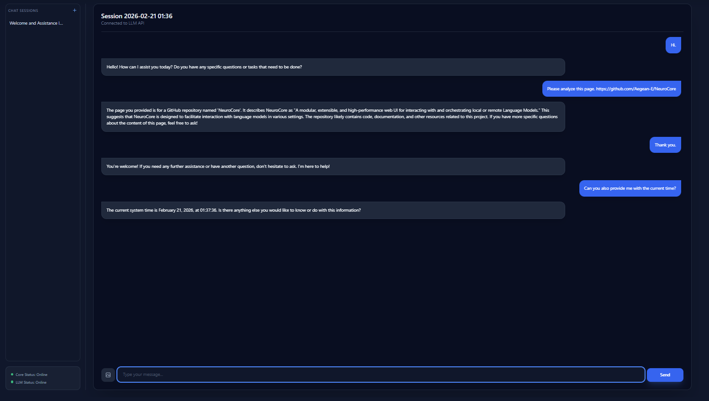
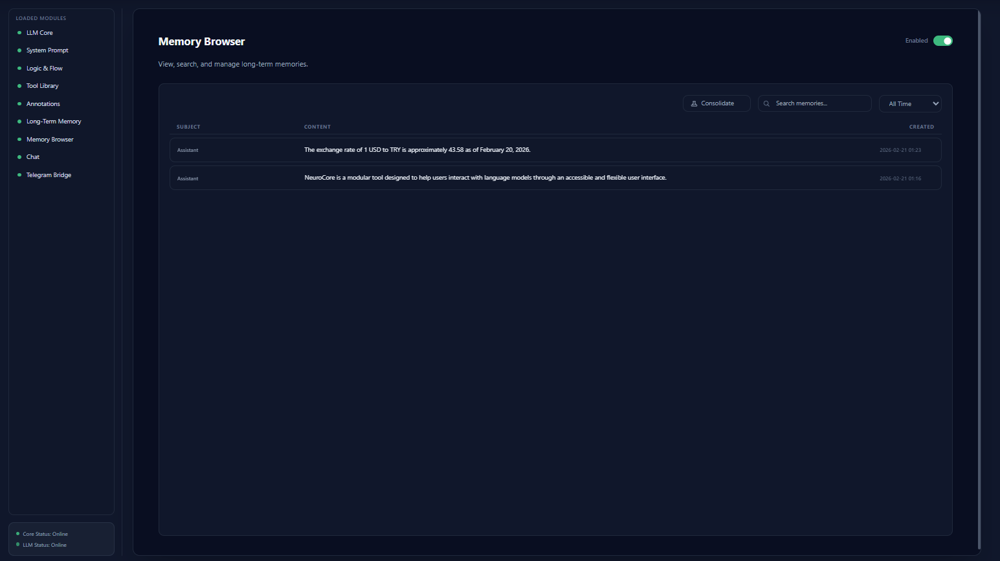
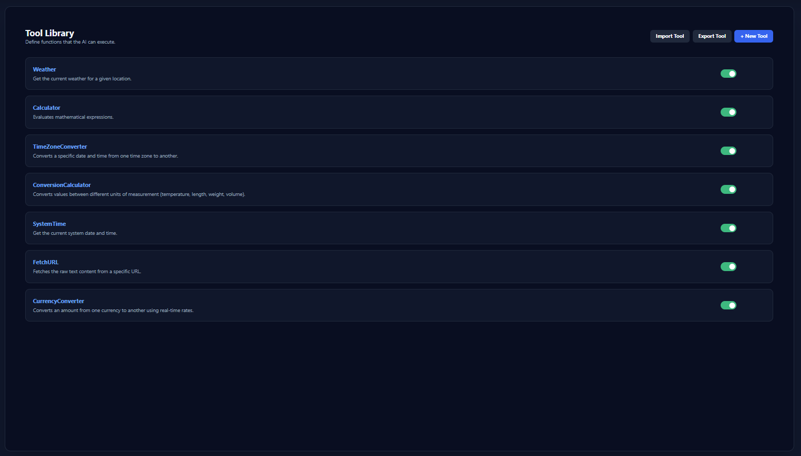

# NeuroCore

<p align="center">
  
</p>

**A modular, extensible, and high-performance web UI for interacting with and orchestrating local or remote Language Models.**

NeuroCore is built on the principles of **Speed**, **Simplicity**, and **Modularity**. It provides a solid foundation for building custom AI-powered applications with a fast, modern web stack and a powerful visual workflow editor.

Whether you are building a simple chatbot or a complex autonomous agent with long-term memory and tool access, NeuroCore provides the building blocks.

---

## 🚀 Core Philosophy

*   **Speed**: The backend is built with **FastAPI**, one of the fastest Python web frameworks available. The frontend uses **HTMX** to deliver fast, server-rendered partials, avoiding a heavy client-side JavaScript footprint.
*   **Simplicity**: The project maintains a clean, logical structure. Data is stored in simple JSON/SQLite files for easy setup and inspection. The frontend logic is co-located with the HTML, making it easy to understand and maintain.
*   **Modularity**: The entire system is designed around a powerful module manager. Features can be enabled, disabled, and created as self-contained packages. This "hot-swapping" capability allows for dynamic extension of the core application without requiring a server restart.

---

## ✨ Key Features

### 🔌 Modular Architecture
NeuroCore is built around a powerful, plugin-based architecture.
*   **Self-Contained Modules**: Each feature (Chat, Memory, Tools, Calendar, Knowledge Base) is an isolated package containing its own backend logic, API routes, and frontend templates.
*   **Hot-Swapping**: Modules can be enabled, disabled, reordered, or updated at runtime without restarting the server via the **Settings -> Modules** interface.
*   **Easy Extensibility**: Create new capabilities by simply dropping a folder into the `modules/` directory with a `module.json` definition.

### 🧠 AI Flow Editor
A visual, node-based canvas to design and orchestrate complex LLM workflows.
<p align="center">
  
</p>

*   **Drag-and-Drop Interface**: Build flows by dragging functions onto the canvas.
*   **Pan & Zoom**: Effortlessly navigate large and complex flows.
*   **Singleton Nodes**: Enforce architectural patterns by restricting certain nodes (like Chat Input/Output) to a single instance per flow.
*   **Flow Management**: Create, save, rename, and switch between multiple AI flows to handle different tasks.
*   **Annotations**: Add comment nodes to document your logic directly on the canvas.
*   **Canvas Controls**: Center the view, clear the canvas, or manage connections (Revert direction, Break link) with dedicated controls.
*   **Available Nodes**: Includes Chat Input/Output, System Prompt, LLM Core, Memory Save/Recall, Telegram Input/Output, Tool Dispatcher, Conditional Router, Calendar Watcher, Repeater, Delay, Scheduled Start, Python Scripting, and more.

### ⚡ Logic & Control Flow
Advanced nodes for complex orchestration.

*   **Delay**: Pause execution for a set duration (configurable in seconds).
*   **Python Scripting**: Execute custom Python code directly within the flow to transform data. Variables `data` (input) and `result` (output) are available.
*   **Repeater**: Create loops or scheduled re-triggers of AI flows. Configure delay interval (hours/minutes/seconds) and max repeats (set to 0 for infinite loops).
*   **Conditional Router**: Routes data based on conditional logic. Checks if a specific field (e.g., tool_calls) exists in the data. If the condition is met, the flow continues. If not, the flow can branch to alternate paths.
*   **Scheduled Start**: Wait until a specific date and time before allowing the flow to proceed. Use to schedule flow execution for a specific time.
*   **Trigger**: Pass-through node to manually trigger or continue a flow.

### 💬 Built-in Chat UI
A clean, modern chat interface for direct interaction with your configured AI flow.
<p align="center">
  
</p>

*   **Multimodal Support**: Upload images to interact with vision-capable models.
*   **Session Management**: Create, rename, and delete chat sessions to organize your conversations.
*   **Auto-Renaming**: Sessions are automatically titled based on the conversation context using a background LLM call.

### 📚 Long-Term Memory
Integrated vector database (FAISS + SQLite) for persistent AI memory regarding user facts and preferences.

*   **Automatic Storage**: Background processing saves user and assistant interactions.
*   **Smart Extraction**: Uses an Arbiter model to extract specific facts and preferences, filtering out noise.
*   **Semantic Consolidation**: Intelligent merging of redundant memories to prevent database bloat and maintain coherence.
*   **Memory Browser**: A dedicated UI to search, filter, and delete stored memories.
    <p align="center">
      
    </p>
*   **Context Injection**: Automatically retrieves relevant memories during conversations based on semantic similarity.

### 🧠 Knowledge Base (RAG)
Retrieval-Augmented Generation support for working with documents.

*   **Document Ingestion**: Upload PDF, Markdown, or Text files directly via the UI.
*   **Vector Search**: Documents are chunked and embedded into a FAISS index for fast retrieval.
*   **Context Injection**: Use the **Knowledge Query** node in your AI Flow to inject relevant document snippets into the LLM's context based on the user's query.

### 📅 Calendar & Scheduling
Manage time-sensitive tasks and events.

*   **Visual Calendar**: A full GUI to view and manage events.
*   **Event Watcher**: A flow node that can check for upcoming events and trigger specific actions or reminders within your AI agent.

### 🛠️ Tools Library
Define and manage custom Python functions (tools) that the LLM can execute.
<p align="center">
  
</p>

*   **Function Calling**: Full support for OpenAI-compatible function calling.
*   **Visual Editor**: Create and edit tools directly in the **Settings -> Tools** UI with JSON schema validation.
*   **Hot-Reloading**: Tools are saved as Python files and loaded dynamically.
*   **Tool Dispatcher**: A dedicated flow node to execute tools requested by the LLM.
*   **Import/Export**: Share tools easily by importing or exporting them as JSON or Python files.

#### Built-in Tools

| Tool | Description |
|------|-------------|
| **Calculator** | Evaluates mathematical expressions (supports math functions, constants, power operator) |
| **ConversionCalculator** | Converts values between units (temperature, length, weight, volume) |
| **CurrencyConverter** | Converts currencies using real-time exchange rates (Frankfurter API) |
| **TimeZoneConverter** | Converts times between timezones (IANA format) |
| **Weather** | Gets current weather for a location (wttr.in API) |
| **SystemTime** | Returns current system date and time |
| **FetchURL** | Fetches and extracts text content from URLs (strips HTML) |
| **SendEmail** | Sends emails via configured SMTP server |
| **SaveReminder** | Saves calendar events/reminders |
| **CheckCalendar** | Retrieves upcoming events or events for a specific date |
| **YouTubeTranscript** | Fetches transcripts from YouTube videos |
| **WikipediaLookup** | Searches and retrieves Wikipedia articles (summary or full) |
| **ArXivSearch** | Searches academic papers on ArXiv |

### 📱 Telegram Integration
Connect your AI flow to Telegram for remote access.

*   **Chat Remotely**: Interact with your AI agent from anywhere via the Telegram app.
*   **Vision Support**: Send photos to Telegram to analyze images using vision-capable models.
*   **Command Control**: Manage sessions (`/new_session`, `/delete_session`) directly from the chat.

### 📖 Reasoning Book
A reasoning journal for AI agents to track their thought processes.

*   **Thought Recording**: Store reasoning steps during flow execution.
*   **Context Injection**: Load previous reasoning into the LLM context for improved responses.

### ⚙️ Core Capabilities
*   **⚙️ Centralized Settings**: A unified **Settings** dashboard to manage all aspects of the application:
    *   **General**: Configure LLM API endpoints, system time, debug mode, and interface preferences (Wide Mode, Footer).
    *   **Modules**: Enable, disable, and reorder modules. Access specific module configurations (e.g., Memory thresholds, Telegram tokens) directly from the list.
    *   **Tools**: A dedicated interface to create, edit, import, and export tools for your AI agents.
*   **🎨 Interface Customization**: Toggle **Wide Mode** for full-width layouts or show/hide the **Footer** via Settings.
*   **💾 Data Management**: Backup your AI Flows directly from the browser via Settings.
*   **🐞 System Debugging**: Enable **Debug Mode** in Settings to reveal a dedicated Debug tab in the navbar, providing real-time logs of AI Flow execution and node events.
*   **✅ Robust Testing**: A comprehensive test suite using `pytest` to ensure code quality and stability.
*   **🌐 Universal LLM Support**: Connect to any OpenAI-compatible API, including local servers (LM Studio, Ollama, LocalAI) and remote providers (OpenAI, Anthropic, Groq).
*   **⚡ High-Performance Backend**: Powered by FastAPI and Uvicorn for asynchronous, non-blocking execution.
*   **🚀 Lightweight Frontend**: Uses HTMX for server-side rendering, eliminating the need for complex build steps or heavy client-side frameworks.

---

## 🛠️ Tech Stack

<p align="center">
  
  
  
  
</p>

*   **Backend**:
    *   Python 3.12+
    *   FastAPI: For the high-performance, asynchronous API.
    *   Uvicorn: As the ASGI server.
    *   HTTPX: For making async requests to the LLM API.
*   **Frontend**:
    *   HTMX: For modern, dynamic browser behavior directly from HTML.
    *   Tailwind CSS: For the utility-first styling.
    *   **Vanilla JavaScript**: Used exclusively for the interactive AI Flow canvas.
*   **Templating**:
    *   Jinja2: For server-side HTML templating.
*   **Data & Search**:
    *   SQLite: For structured data storage.
    *   FAISS: For efficient vector similarity search.

---

## ⚙️ Getting Started

Follow these steps to get NeuroCore up and running on your local machine.

### 1. Prerequisites

*   **Python 3.12 or higher.**
*   An **OpenAI-compatible LLM API endpoint**. This can be from a local server like LM Studio, Ollama, or any other service that exposes a `/v1/chat/completions` endpoint.

### 2. Installation

1.  **Clone the repository:**
    ```bash
    git clone <your-repository-url>
    cd NeuroCore
    ```

2.  **Create and activate a virtual environment** (recommended):
    ```bash
    # For Windows
    python -m venv venv
    .\venv\Scripts\activate

    # For macOS/Linux
    python3 -m venv venv
    source venv/bin/activate
    ```

3.  **Install the required dependencies:**
    ```bash
    pip install fastapi uvicorn httpx jinja2 numpy faiss-cpu "pytest<9" "pytest-cov" "pytest-httpx" "pytest-asyncio" python-multipart
    ```

### 3. Configuration

1.  The application uses `settings.json` for configuration. If it doesn't exist, it will be created with default values on the first run.
2.  Run the application once to generate the file, or create it manually.
3.  Open `settings.json` and update the `llm_api_url` to point to your running LLM service. Alternatively, you can configure these settings via the **Settings -> General** tab in the web UI after starting the application.

    ```json
    {
        "llm_api_url": "http://localhost:1234/v1",
        "llm_api_key": "",
        "default_model": "local-model",
        "embedding_api_url": "",
        "embedding_model": "",
        "active_ai_flow": "default-flow-001"
    }
    ```

### 4. Running the Application

Execute the `main.py` file to start the web server:

```bash
python main.py
```

The application will be available at `http://localhost:8000`.

---

## 📂 Project Structure

```
NeuroCore/
├── core/                     # Core application logic
│   ├── dependencies.py       # FastAPI dependency injection
│   ├── debug.py              # Debug logging system
│   ├── flow_manager.py       # AI Flow CRUD operations
│   ├── flow_runner.py        # Flow execution engine
│   ├── llm.py                # LLM API client
│   ├── module_manager.py     # Dynamic module loading
│   ├── routers.py            # Main API routes
│   └── settings.py           # Settings management
├── modules/                  # Self-contained feature modules
│   ├── annotations/          # Flow annotation/comment nodes
│   ├── calendar/             # Calendar and event management
│   ├── chat/                 # Chat UI and session management
│   ├── knowledge_base/       # RAG document processing
│   ├── logic/                # Logic nodes (Delay, Repeater, etc.)
│   ├── llm_module/          # Core LLM node
│   ├── memory/               # Long-term memory (FAISS)
│   ├── memory_browser/       # Memory management UI
│   ├── reasoning_book/       # Reasoning journal
│   ├── system_prompt/        # System prompt injection
│   ├── telegram/             # Telegram bot integration
│   └── tools/                # Tool library and dispatcher
├── tests/                    # Comprehensive test suite
├── web/
│   └── templates/            # Jinja2 HTML templates
├── ai_flows.json            # Saved AI Flow definitions
├── chat_sessions.json        # Chat history storage
├── main.py                   # FastAPI application entry
├── settings.json             # Runtime configuration
└── README.md                # This file
```

---

## 🧩 Available AI Flow Nodes

### Input Nodes
| Node | Description |
|------|-------------|
| **Chat Input** | Receives user messages from the chat interface |
| **Telegram Input** | Receives messages from Telegram |

### Processing Nodes
| Node | Description |
|------|-------------|
| **LLM Core** | Calls the configured LLM with messages |
| **System Prompt** | Injects system prompts and enables tools |
| **Memory Save** | Saves content to long-term memory |
| **Memory Recall** | Retrieves relevant memories semantically |
| **Knowledge Query** | Queries the knowledge base for context |
| **Reasoning Load** | Loads reasoning history into context |

### Output Nodes
| Node | Description |
|------|-------------|
| **Chat Output** | Sends responses to the chat interface |
| **Telegram Output** | Sends responses to Telegram |
| **Tool Dispatcher** | Executes tools requested by the LLM |

### Logic Nodes
| Node | Description |
|------|-------------|
| **Trigger** | Pass-through node for manual triggering |
| **Delay** | Pauses execution for specified seconds |
| **Python Script** | Executes custom Python code |
| **Repeater** | Re-triggers flow after delay (supports loops) |
| **Conditional Router** | Routes based on field existence |
| **Scheduled Start** | Waits until specific date/time |

### Utility Nodes
| Node | Description |
|------|-------------|
| **Annotation** | Adds comments to document flow logic |

---

## 🧩 Creating a New Module

The modular architecture is NeuroCore's strongest feature. Here's how to create your own module.

### Step 1: Create the Module Directory

Create a new folder inside the `modules/` directory. For example, `modules/my_new_module`.

### Step 2: Define the Module Metadata

Create a `module.json` file inside your new folder. This file tells NeuroCore about your module.

```json
{
    "name": "My New Module",
    "description": "A short description of what this module does.",
    "enabled": false,
    "id": "my_new_module",
    "is_flow_node": true,
    "singleton": false,
    "order": 99,
    "provides_nodes": [
        {
            "id": "my_custom_node",
            "name": "My Custom Node",
            "description": "A custom processing step.",
            "singleton": false,
            "configurable": true
        }
    ]
}
```

### Step 3: Add Functionality

#### To Add API Routes (like the Chat module):

1.  Create a `router.py` file in your module directory to define your FastAPI `APIRouter`.
2.  Create an `__init__.py` file in the same directory and expose your router:
    ```python
    # modules/my_new_module/__init__.py
    from .router import router
    ```

#### To Add AI Flow Nodes:

1.  Create a `node.py` file in your module directory.
2.  Define one or more "Executor" classes. Each class must have `async def receive(self, data)` and `async def send(self, data)` methods.
3.  Create a dispatcher function `get_executor_class(node_type_id)` that returns the correct class based on the `id` from your `module.json`.

    ```python
    # modules/my_new_module/node.py
    class MyCustomNodeExecutor:
        async def receive(self, input_data: dict) -> dict:
            # Process the data...
            return input_data

        async def send(self, processed_data: dict) -> dict:
            # Pass the result to the next node
            return processed_data

    async def get_executor_class(node_type_id: str):
        if node_type_id == 'my_custom_node':
            return MyCustomNodeExecutor
        return None
    ```

---

## 🔧 Tool Library

NeuroCore includes a powerful **Tool Library** that implements OpenAI-compatible function calling. This allows your AI agents to interact with external APIs, databases, or perform calculations.

1.  **Define**: Create tools in the **Settings -> Tools** tab using a visual editor. You define the JSON schema for parameters and the Python code to execute.
2.  **Enable**: In your AI Flow, select the **System Prompt** node and enable the specific tools you want the agent to use.
3.  **Execute**: Add a **Tool Dispatcher** node to your flow. When the LLM decides to call a function, the dispatcher executes your Python code and returns the result to the LLM.

### Creating Custom Tools

Tools are defined with:
- **Name**: Unique identifier for the tool
- **Description**: What the tool does (helps the LLM decide when to use it)
- **Parameters**: JSON schema for arguments
- **Code**: Python code to execute (receives `args` dict, sets `result` string)

Example tool code:
```python
# Available variables: args (dict), result (str), json, httpx
location = args.get('location')
if not location:
    result = "Error: Please provide a location"
else:
    result = f"Hello from {location}!"
```

For a comprehensive guide on creating and using tools, see `modules/TOOL_GUIDE.md`.

---

## 🧪 Testing

The project includes a robust test suite using `pytest`. To run the tests, execute the provided runner script:

```bash
python tests/run_tests.py
```

To include a coverage report, use the `--coverage` flag:

```bash
python tests/run_tests.py --coverage
```

### Running Specific Tests

```bash
# Run tool library tests
python -m pytest tests/test_tools_library.py -v

# Run logic node tests
python -m pytest tests/test_logic_nodes.py -v

# Run memory tests
python -m pytest tests/test_memory_*.py -v
```

---

## 🔧 Environment Variables

NeuroCore supports the following environment variables:

| Variable | Description | Default |
|----------|-------------|---------|
| `SMTP_SERVER` | SMTP server for email tool | `smtp.gmail.com` |
| `SMTP_PORT` | SMTP port | `587` |
| `SMTP_EMAIL` | Email address for sending | (not set) |
| `SMTP_PASSWORD` | Email password/app password | (not set) |

---

## 📱 Telegram Bot Setup

1.  Create a bot via @BotFather on Telegram
2.  Get the API token
3.  Enable the Telegram module in Settings
4.  Enter the API token in the module configuration
5.  Start chatting with your bot!

### Available Commands
| Command | Description |
|---------|-------------|
| `/new_session` | Start a new chat session |
| `/delete_session` | Delete the current session |

---

## 🧠 Memory System

NeuroCore's memory system uses FAISS for semantic search:

1.  **Save**: The Memory Save node extracts facts from conversations using an Arbiter model
2.  **Consolidate**: Redundant memories are merged to prevent bloat
3.  **Recall**: The Memory Recall node finds semantically similar memories to inject into context

Configuration options:
- **Similarity Threshold**: Minimum similarity score for recall (0.0-1.0)
- **Max Memories**: Maximum number of memories to retrieve
- **Consolidation Interval**: How often to run memory consolidation

---

## 📚 Knowledge Base (RAG)

Upload documents and query them semantically:

1.  **Upload**: Drag and drop PDF, Markdown, or Text files
2.  **Processing**: Documents are chunked and embedded using configured embedding model
3.  **Query**: Use the Knowledge Query node to retrieve relevant passages

Configuration:
- **Chunk Size**: Size of text chunks (default: 500)
- **Chunk Overlap**: Overlap between chunks (default: 50)
- **Embedding Model**: Model used for vectorization

---

## 📜 License

This project is licensed under the **Apache License, 2.0**. See the LICENSE file for full details.

---

<p align="center">
  <strong>NeuroCore</strong> - Build powerful AI agents with modular simplicity
</p>
