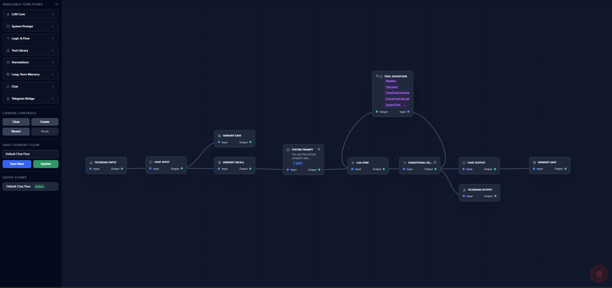
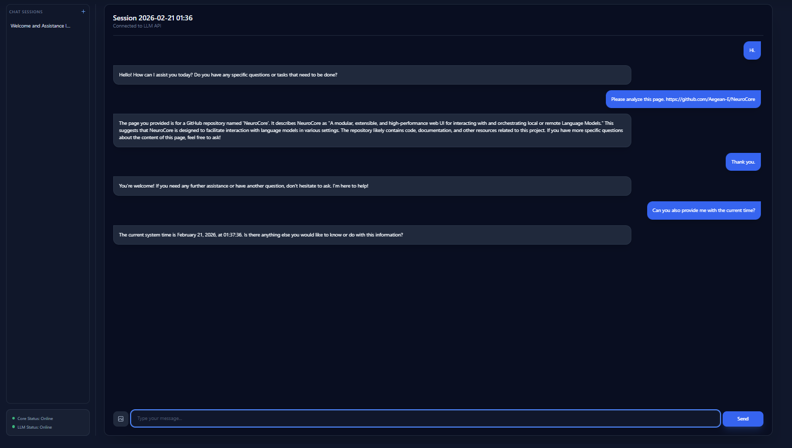
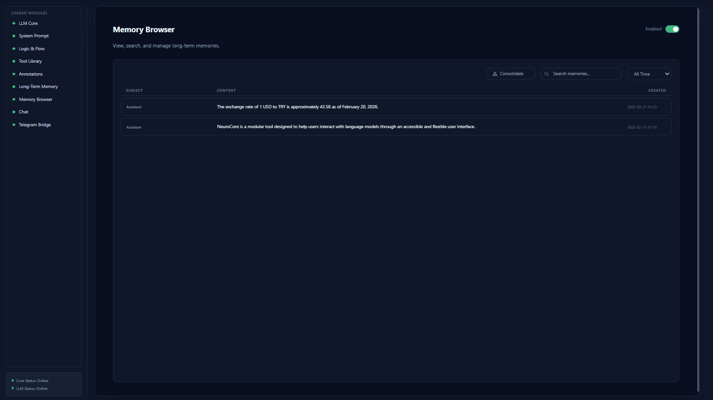
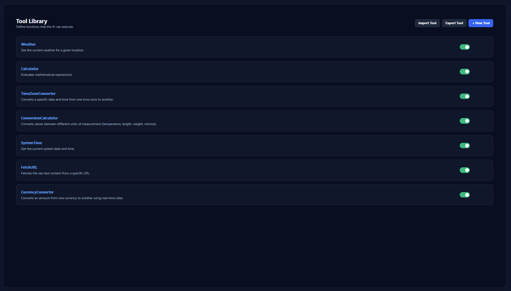

# NeuroCore

<p align="center">
  
</p>

<p align="center">
  <a href="https://python.org"></a>
  <a href="https://fastapi.tiangolo.com"></a>
  <a href="https://htmx.org"></a>
  <a href="https://tailwindcss.com"></a>
  
  <a href="https://github.com/Aegean-E/NeuroCore/blob/main/LICENSE"></a>
</p>

<p align="center">
  
  
  
  
  
</p>

<p align="center">
  
  
  
  
  
  
  
  
  
</p>


---

**NeuroCore** is a powerful, modular AI agent framework that transforms how you build and deploy autonomous AI applications. Whether you need a smart chatbot with persistent memory, a document-aware assistant, or a fully autonomous agent that can set goals and use tools — NeuroCore provides the complete toolkit.

Built on the principles of **Speed**, **Simplicity**, and **Modularity**, NeuroCore delivers a solid foundation for building custom AI-powered applications with a fast, modern web stack and a powerful visual workflow editor.

<p align="center">
  <b>70+ Python files &nbsp;•&nbsp; 32 HTML templates &nbsp;•&nbsp; 66 tests &nbsp;•&nbsp; 16 modules &nbsp;•&nbsp; 16 built-in tools &nbsp;•&nbsp; 37+ API routes</b>
</p>


---

## 🔥 Why NeuroCore?

- **🎨 Visual AI Flow Editor** — Design complex AI workflows with a drag-and-drop canvas. Chain LLM calls, memory retrieval, knowledge queries, tool execution, and more — all without writing code.

- **🧠 Persistent Long-Term Memory** — Built-in FAISS vector database stores user facts and preferences. Smart extraction and semantic consolidation keep memory organized and relevant.

- **📚 Knowledge Base (RAG)** — Upload PDFs, Markdown, or text files. NeuroCore automatically chunks, embeds, and indexes your documents for intelligent retrieval-augmented generation.

- **🔧 Function Calling & Tools** — Give your AI agency with custom Python tools. From calculators to web search, the LLM can execute code to accomplish real tasks.

- **🤖 Autonomous Agent Capabilities** — Set goals, track progress, and let your agent work independently with the goal system.

- **📱 Multi-Platform** — Built-in Chat UI with multimodal support, Telegram bot integration, and calendar scheduling.

- **⚡ High Performance** — FastAPI backend with HTMX frontend delivers snappy, responsive interactions without heavy JavaScript.

- **🔌 Hot-Swap Modules** — Enable or disable any module at runtime without restarting the server. Drop a folder into `modules/` to extend the system.

- **🔍 Hybrid Search** — Combines FAISS vector search + SQLite FTS5 keyword search with Reciprocal Rank Fusion (RRF) for best-in-class document retrieval.

- **🔒 Secure Tool Sandbox** — All custom Python tools execute in a restricted environment with blocked dangerous imports, network whitelisting, resource limits, and SSRF protection.

- **📊 Observability** — Built-in distributed tracing, metrics collection, and structured JSON logging for debugging and monitoring.


---

## 🏗️ Architecture

NeuroCore is organized into **4 clean, decoupled layers** that work together to deliver a seamless AI experience:

### System Overview

At its heart, NeuroCore is a **flow-based execution engine** that treats AI workflows as directed graphs. Each node represents a discrete operation—whether that's calling an LLM, querying a database, or executing custom code. The engine orchestrates these nodes in the correct order, handling data flow, error recovery, and parallel execution automatically.

```
┌─────────────────────────────────────────────────────────────────┐
│                     User Interaction Layer                       │
│  ┌─────────────┐  ┌─────────────┐  ┌─────────────────────────┐ │
│  │   Chat UI   │  │  Telegram   │  │    Visual Flow Editor     │ │
│  │  (Browser)  │  │    Bot      │  │      (Canvas-based)       │ │
│  └──────┬──────┘  └──────┬──────┘  └───────────┬───────────────┘ │
└─────────┼────────────────┼─────────────────────┼────────────────┘
          │                │                     │
          └────────────────┴─────────────────────┘
                            │
                            ▼
┌─────────────────────────────────────────────────────────────────┐
│                     Flow Execution Engine                       │
│                                                                 │
│   ┌──────────────┐    ┌──────────────┐    ┌──────────────┐      │
│   │  FlowRunner  │───▶│  DAG Builder │───▶│  Kahn's Sort │      │
│   │  (Orchestrator)   │  (Topology)  │    │  (Ordering)  │      │
│   └──────────────┘    └──────────────┘    └──────────────┘      │
│          │                                                      │
│          ▼                                                      │
│   ┌──────────────┐    ┌──────────────┐    ┌──────────────┐      │
│   │ Node Executor│◀──▶│ Bridge Groups│◀──▶│ Conditional  │      │
│   │  (Async)     │    │  (Parallel)  │    │   Routing    │      │
│   └──────────────┘    └──────────────┘    └──────────────┘      │
│                                                                 │
└─────────────────────────────────────────────────────────────────┘
                            │
          ┌─────────────────┼─────────────────┐
          │                 │                 │
          ▼                 ▼                 ▼
┌──────────────┐  ┌──────────────┐  ┌──────────────┐
│   Memory     │  │  Knowledge   │  │    Tools     │
│   System     │  │    Base      │  │   Library    │
│  (FAISS+SQL) │  │   (RAG)      │  │  (Sandboxed) │
└──────────────┘  └──────────────┘  └──────────────┘


```
```
┌──────────────────────────────────────────────────────────────┐
│           🌐 Web Layer                                       │

│   HTMX + Jinja2 (32 templates) + TailwindCSS                │
│   Zero heavy JS frameworks — server-driven UI updates        │
├──────────────────────────────────────────────────────────────┤
│           ⚙️  Core Layer                                     │
│   main.py          → FastAPI app + lifespan manager          │
│   core/routers.py  → All HTTP routes (37+ endpoints)         │
│   core/observability.py → Distributed tracing + metrics      │
│   core/session_manager.py → Session persistence + tracing     │
│   core/structured_output.py → Pydantic schema enforcement    │
│   core/flow_runner.py  → DAG execution engine (Kahn's algo)  │
│   core/flow_manager.py → Flow CRUD (ai_flows.json)           │
│   core/module_manager.py → Dynamic hot-swap module loader    │
│   core/llm.py      → OpenAI-compatible HTTP client           │
│   core/settings.py → Thread-safe settings manager            │
│   core/debug.py    → Structured debug logging system         │
├──────────────────────────────────────────────────────────────┤
│           🔌 Module Layer                                    │
│   modules/<name>/                                            │
│     module.json  → Metadata, config, enabled flag, nodes     │
│     node.py      → Executor classes + dispatcher             │
│     router.py    → FastAPI router (optional)                 │
│     __init__.py  → Exports router for hot-loading            │
├──────────────────────────────────────────────────────────────┤
│           💾 Data Layer                                      │
│   data/memory.sqlite3 + memory.faiss  → Long-term memory     │
│   data/knowledge_base.sqlite3 + .faiss→ RAG documents        │
│   settings.json    → Runtime configuration                   │
│   ai_flows.json    → Saved flow definitions                  │
│   chat_sessions.json → Chat session history                  │
└──────────────────────────────────────────────────────────────┘
```

---

## ✨ Key Features

### 🧠 AI Flow Editor
A visual, node-based canvas to design and orchestrate complex LLM workflows.

<p align="center">
  
</p>

- **Drag-and-Drop Interface** — Build flows by dragging functions onto the canvas
- **Pan & Zoom** — Effortlessly navigate large and complex flows
- **Multiple Active Flows** — Run multiple flows simultaneously for different tasks
- **Flow Import/Export** — Share flows by exporting as JSON files
- **Singleton Nodes** — Enforce architectural patterns by restricting certain nodes
- **Annotations** — Add comment nodes to document your logic directly on the canvas
- **Keyboard Shortcuts** — Ctrl+A (select all), Ctrl+Z (undo), Delete (remove), Space+Drag (pan), Scroll (zoom)
- **Selection Box** — Click and drag to select multiple nodes
- **Flow Validation** — Pre-execution checks for disabled modules, orphaned connections, and missing tools

### ⚡ Logic & Control Flow
Advanced nodes for complex orchestration:

| Node | Description |
|------|-------------|
| **Delay** | Pause execution for a set duration (configurable in seconds) |
| **Python Scripting** | Execute custom Python code directly within the flow |
| **Repeater** | Create loops or scheduled re-triggers (set to 0 for infinite) |
| **Conditional Router** | Route data based on conditional logic |
| **Scheduled Start** | Wait until a specific date/time before proceeding |
| **Trigger** | Pass-through node for manual triggering |

### 💬 Built-in Chat UI
A clean, modern chat interface for direct interaction with your configured AI flow.

<p align="center">
  
</p>

- **Multimodal Support** — Upload images to interact with vision-capable models
- **Session Management** — Create, rename, and delete chat sessions
- **Auto-Renaming** — Sessions automatically titled based on conversation context

### 📚 Long-Term Memory
**FAISS + SQLite with LLM-powered filtering — not your average RAG.**

Most AI assistants use naive vector retrieval. NeuroCore's memory system is built different:

<p align="center">
  
</p>

- **FAISS + SQLite** — Fast vector search backed by persistent storage
- **Arbiter Model** — LLM-powered gate that filters what gets saved (configurable confidence threshold)
- **Semantic Consolidation** — Auto-merges similar/redundant memories to prevent bloat
- **Smart Extraction** — Extracts structured facts (FACT, BELIEF, PREFERENCE, IDENTITY) from conversations
- **Conflict Detection** — LLM identifies contradictory memories
- **TTL & Access Weight** — Old memories fade, frequently accessed ones persist longer
- **Memory Browser** — UI to search, filter, edit, merge, and delete memories
- **Audit Log** — Full `meta_memories` table tracks every edit, merge, delete, and conflict action
- **Goals System** — Dedicated goals table with priority, status, deadline, and context

#### Memory Types

| Type | Description |
|------|-------------|
| `FACT` | Verified, persistent information |
| `BELIEF` | Unverified — expires after 30 days by default |
| `PREFERENCE` | User preferences and tastes |
| `IDENTITY` | Identity facts (name, background, personality) |
| `RULE` | Behavioral rules and instructions |
| `EXPERIENCE` | Past events and experiences |

#### Memory Save Pipeline

```
Conversation Text
      │
      ▼
MemorySaveExecutor.receive()   ← pass-through (non-blocking)
      │
      ▼  asyncio.create_task() — fire and forget
_save_background()
      │
      ▼
LLM Smart Extraction           ← structured JSON facts
      │
      ▼
MemoryArbiter.consider()       ← confidence threshold gate
      │
      ▼
MemoryConsolidator             ← auto-merge similar memories (every N hours)
      │
      ▼
MemoryStore.add_entry()        ← FAISS index + SQLite
```

#### Memory Recall Pipeline

```
User Message → Embedding → FAISS Search → Score Filter
      │
      ▼
_memory_context injected into input_data
      │
      ▼
SystemPromptExecutor           ← picks up _memory_context
      │
      ▼
Injected into system message   ← LLM receives relevant memories
```

### 🧠 Knowledge Base (RAG)
Retrieval-Augmented Generation with **hybrid search** for working with documents.

- **Document Ingestion** — Upload PDF, Markdown, or Text files via UI
- **Vector Search** — Documents chunked and embedded into FAISS index
- **Keyword Search** — SQLite FTS5 full-text search with auto-sync triggers
- **Hybrid Search** — Reciprocal Rank Fusion (RRF, k=60) combines vector + keyword results
- **Semantic Retrieval** — Knowledge Query node injects relevant context
- **Self-Healing Index** — Automatically rebuilds FAISS index on startup if out of sync
- **Integrity Checks** — Detects chunk count mismatches and missing embeddings

#### Knowledge Base Search Modes

| Mode | Implementation | Best For |
|------|---------------|----------|
| **Vector Search** | FAISS `IndexFlatIP` + L2 normalization | Semantic similarity |
| **Keyword Search** | SQLite FTS5 virtual table | Exact term matching |
| **Hybrid Search** | Reciprocal Rank Fusion (RRF) | Best overall accuracy |

### 📅 Calendar & Scheduling
Manage time-sensitive tasks and events.

- **Visual Calendar** — Full GUI to view and manage events
- **Event Watcher** — Flow node that checks for upcoming events
- **Scheduled Execution** — Trigger actions at specific times

### 🛠️ Tools Library with Secure Sandbox
Define and manage custom Python functions that the LLM can execute—**safely**.

<p align="center">
  
</p>

- **Function Calling** — Full support for OpenAI-compatible function calling
- **Visual Editor** — Create tools with JSON schema validation
- **Hot-Reloading** — Tools saved as Python files, loaded dynamically
- **Tool Dispatcher** — Execute tools requested by the LLM
- **Import/Export** — Share tools as JSON or Python files
- **Per-Node Control** — `allowed_tools` config restricts which tools each dispatcher can use
- **Rate Limiting** — `max_tools_per_turn` (default: 5) prevents runaway tool loops
- **🔒 Secure Sandbox** — All tools execute in a restricted environment (see Security section)

#### Security Sandbox Architecture

Every tool executes in an isolated sandbox with multiple defense layers:

```
┌─────────────────────────────────────────────────────────────┐
│                    Tool Execution Flow                      │
│                                                             │
│  Tool Code → Static Analysis → Restricted Globals → Exec    │
│                  │                    │                     │
│                  ▼                    ▼                     │
│         ┌────────────────┐    ┌────────────────┐            │
│         │  Blocked:      │    │  Allowed:      │            │
│         │  • import os   │    │  • import math │            │
│         │  • eval()      │    │  • import json │            │
│         │  • exec()      │    │  • Safe HTTP   │            │
│         │  • __import__  │    │  • File access │            │
│         └────────────────┘    │   (restricted) │           │
│                               └────────────────┘            │
│                                                             │
│  Security Features:                                         │
│  • Domain whitelisting for HTTP requests                    │
│  • SSRF protection (blocks 127.0.0.1, 10.x.x.x, etc.)       │
│  • Resource limits (timeout, memory, output size)           │
│  • Path traversal prevention                                │
│  • Dangerous builtin blocking                               │
└─────────────────────────────────────────────────────────────┘
```

**Security Features:**
- **Restricted Imports** — Blocks `os`, `sys`, `subprocess`, `socket`, and 20+ dangerous modules
- **Safe HTTP Client** — Domain whitelisting with SSRF protection for internal IPs
- **File Access Control** — Optional read-only mode with directory restrictions
- **Resource Limits** — Configurable timeout (default 30s), max output size (100KB)
- **Static Analysis** — Pre-execution code scanning for dangerous patterns


#### Built-in Tools (16 Total)

**🧮 Calculations & Conversions**
| Tool | Description |
|------|-------------|
| **Calculator** | Evaluates mathematical expressions |
| **ConversionCalculator** | Converts units (temperature, length, weight, volume) |
| **CurrencyConverter** | Real-time currency conversion (Frankfurter API) |
| **TimeZoneConverter** | Timezone conversions (IANA format) |
| **SystemTime** | Current date and time |

**🌐 Web & Search**
| Tool | Description |
|------|-------------|
| **Weather** | Current weather for any location |
| **FetchURL** | Extracts text content from URLs |
| **WikipediaLookup** | Searches Wikipedia articles |
| **ArXivSearch** | Searches academic papers |
| **YouTubeTranscript** | Fetches YouTube video transcripts |

**📅 Calendar & Goals**
| Tool | Description |
|------|-------------|
| **SaveReminder** | Saves calendar events/reminders |
| **CheckCalendar** | Retrieves upcoming events |
| **SetGoal** | Creates a new goal for autonomous agents |
| **MarkGoalComplete** | Marks a goal as completed |
| **DeleteGoal** | Deletes a goal |

**📧 Communication**
| Tool | Description |
|------|-------------|
| **SendEmail** | Sends emails via SMTP |


### 📱 Telegram Integration
Connect your AI flow to Telegram for remote access.

- **Chat Remotely** — Interact with your AI from anywhere
- **Vision Support** — Send photos to analyze with vision models
- **Command Control** — Manage sessions with `/new_session`, `/delete_session`

### 📖 Reasoning Book
A reasoning journal for AI agents.

- **Thought Recording** — Store reasoning steps during flow execution
- **Context Injection** — Load previous reasoning into LLM context

### 🔌 Modular Architecture
NeuroCore is built around a powerful, plugin-based architecture.

- **Self-Contained Modules** — Each feature is an isolated package
- **Hot-Swapping** — Enable/disable modules at runtime without restart
- **Easy Extensibility** — Drop a folder into `modules/` with a `module.json`
- **Thread-Safe** — All module state mutations protected by `threading.Lock()`
- **Config Persistence** — Module configs written back to `module.json` automatically

#### Available Modules

| Module | Purpose | Router | Flow Node |
|--------|---------|--------|-----------|
| `chat` | Chat UI + session management | ✅ | ✅ |
| `memory` | FAISS+SQLite long-term memory | ✅ | ✅ |
| `knowledge_base` | RAG document ingestion | ✅ | ✅ |
| `tools` | Tool library + dispatcher | ✅ | ✅ |
| `system_prompt` | System prompt injection | ✅ | ✅ |
| `llm_module` | Core LLM call node | ✅ | ✅ |
| `telegram` | Telegram bot integration | ✅ | ✅ |
| `calendar` | Calendar + event management | ✅ | ✅ |
| `reasoning_book` | Reasoning journal | ✅ | ✅ |
| `memory_browser` | Memory management UI | ✅ | — |
| `logic` | Delay, Repeater, Conditional, etc. | — | ✅ |
| `annotations` | Flow comment nodes | — | ✅ |
| `planner` | Planner node | — | ✅ |
| `agent_loop` | Agent loop node | — | ✅ |
| `reflection` | Reflection node | — | ✅ |
| `skills` | Instruction file management | ✅ | — |

---

### 📋 Skills Management
Manage reusable instruction files for AI tasks.

- **SKILL.md Files** — Create best practices, patterns, and guidelines
- **Import/Export** — Share skills as files
- **Prompt Injection** — Automatically inject skill content into system prompts

---

## ⚙️ How It Works — The Flow Engine

The `FlowRunner` executes AI flows as a **Directed Acyclic Graph (DAG)** using Kahn's topological sort algorithm.

### Node Execution Contract

Every node executor implements two async methods:

```python
async def receive(self, input_data: dict, config: dict = None) -> dict | None:
    # Process input. Return None to STOP the branch (conditional logic).
    ...

async def send(self, processed_data: dict) -> dict:
    # Return output passed to all downstream nodes.
    ...
```

### Key Engine Mechanisms

| Mechanism | Implementation | Purpose |
|-----------|---------------|---------|
| **Topological Sort** | Kahn's algorithm | Deterministic execution ordering based on dependencies |
| **Cycle Detection** | Heuristic break | Detects cycles and picks lowest in-degree node to continue |
| **Bridge Nodes** | BFS component grouping | Implicit parallel connections for synchronized execution |
| **Conditional Routing** | `_route_targets` key | Dynamic branching based on runtime conditions |
| **Context Propagation** | `messages` key preservation | Maintains conversation history across all nodes |
| **Loop Guard** | `max_node_loops` counter | Prevents infinite loops (default: 1,000 iterations) |
| **Executor Cache** | Class-level `_executor_cache` | Avoids re-importing modules on every execution |
| **Dynamic Import** | `importlib` + `reload()` | Hot code updates without server restart |
| **Background Tasks** | `asyncio.create_task()` | Non-blocking operations (memory save, consolidation) |
| **Auto-Start** | Lifespan event handler | Repeater nodes start automatically on app launch |
| **Bridge Execution** | Upstream-to-downstream ordering | Ensures bridged nodes execute in correct sequence |

### Bridge Nodes: Advanced Parallel Execution

Bridge nodes are a unique NeuroCore feature that enables **implicit parallel execution** with synchronized data sharing:

```
┌─────────┐      ┌─────────┐      ┌─────────┐
│ Node A  │◀────▶│ Node B  │◀────▶│ Node C  │
│(Input)  │bridge│(Process)│bridge│(Output) │
└─────────┘      └─────────┘      └─────────┘
      │                │                │
      └────────────────┴────────────────┘
              Bridge Group
              
All nodes in a bridge group:
• Execute in upstream-to-downstream order
• Share data via bridge_input merging
• Enable parallel processing patterns
```

**How Bridges Work:**
1. **Bridge Groups** — BFS identifies connected components of bridged nodes
2. **Execution Order** — Nodes execute in topological order within the group
3. **Data Merging** — Each node receives merged output from all upstream bridged nodes
4. **Synchronization** — Ensures all bridged nodes complete before downstream nodes execute

**Use Cases:**
- **Multi-Input Processing** — Combine outputs from multiple LLM calls
- **Parallel Tool Execution** — Run independent tools simultaneously
- **Data Aggregation** — Merge results from different sources before final output


### Typical Flow Execution

```
Chat Input  ──►  Memory Recall  ──►  System Prompt  ──►  LLM Core
                                                              │
                                                    ┌─────────┴──────────┐
                                                    ▼                    ▼
                                            Tool Dispatcher        Chat Output
                                                    │
                                                    ▼
                                              LLM Core (2nd pass)
                                                    │
                                                    ▼
                                              Chat Output
```

---

## 🧩 Available AI Flow Nodes

NeuroCore provides **25+ built-in nodes** organized by function. Each node follows the `receive()` → `send()` contract for input processing and output generation.

### Input Nodes
| Node | Description | Output |
|------|-------------|--------|
| **Chat Input** | Receives user messages from the chat interface | `{"messages": [...]}` |
| **Telegram Input** | Receives messages from Telegram bot | `{"messages": [...]}` |

### Processing Nodes
| Node | Description | Key Features |
|------|-------------|--------------|
| **LLM Core** | Calls the configured LLM with messages | Streaming support, tool calling, vision |
| **System Prompt** | Injects system prompts and enables tools | Merges `_memory_context`, `_kb_context` |
| **Memory Save** | Saves content to long-term memory | Async background processing, arbiter filtering |
| **Memory Recall** | Retrieves relevant memories semantically | FAISS vector search, score thresholding |
| **Knowledge Query** | Queries the knowledge base for context | Hybrid search (vector + keyword) |
| **Check Goal** | Injects current goal into context | Priority-based goal selection |
| **Reasoning Load** | Loads reasoning history into context | Temporal reasoning injection |

### Output Nodes
| Node | Description | Use Case |
|------|-------------|----------|
| **Chat Output** | Sends responses to the chat interface | Standard chat responses |
| **Telegram Output** | Sends responses to Telegram | Remote bot interactions |
| **Tool Dispatcher** | Executes tools requested by the LLM | Function calling, sandboxed execution |

### Logic & Control Nodes
| Node | Description | Configuration |
|------|-------------|---------------|
| **Trigger** | Pass-through node for manual triggering | Used with "Run Node" button |
| **Delay** | Pauses execution for specified seconds | `seconds` parameter |
| **Python Script** | Executes custom Python code | `code` parameter with sandbox |
| **Repeater** | Re-triggers flow after delay | `delay_seconds`, `max_repeats` (0=infinite) |
| **Conditional Router** | Routes based on field existence | Checks for `_route_targets` key |
| **Scheduled Start** | Waits until specific date/time | ISO 8601 datetime string |

### Utility Nodes
| Node | Description | Visual |
|------|-------------|--------|
| **Annotation** | Adds comments to document flow logic | Yellow note-style node |
| **Bridge** | Connects nodes for parallel execution | Visual bridge indicator |

### Node Execution Contract

Every node implements this async interface:

```python
class NodeExecutor:
    async def receive(self, input_data: dict, config: dict = None) -> dict | None:
        """
        Process input data.
        
        Args:
            input_data: Data from upstream nodes (merged if multiple)
            config: Node-specific configuration from flow editor
        
        Returns:
            dict: Output data passed to downstream nodes
            None: STOP this branch (conditional logic)
        """
        # Process input...
        return {"key": "value"}  # or None to stop branch
    
    async def send(self, processed_data: dict) -> dict:
        """
        Finalize output before passing to next nodes.
        
        Args:
            processed_data: Data from receive() method
        
        Returns:
            dict: Final output for downstream consumption
        """
        return processed_data
```

### Special Keys & Conventions

| Key | Purpose | Set By | Read By |
|-----|---------|--------|---------|
| `messages` | Conversation history | Chat Input | LLM Core, System Prompt |
| `_memory_context` | Retrieved memories | Memory Recall | System Prompt |
| `_kb_context` | Knowledge base results | Knowledge Query | System Prompt |
| `_route_targets` | Conditional routing | Any node | FlowRunner |
| `tool_calls` | LLM tool requests | LLM Core | Tool Dispatcher |
| `tool_results` | Tool execution results | Tool Dispatcher | LLM Core |
| `requires_continuation` | Multi-turn tool loops | Tool Dispatcher | Conditional Router |


---

## 🛠️ Tech Stack

| Layer | Technology | Purpose |
|-------|-----------|---------|
| **Backend** | Python 3.12+, FastAPI, Uvicorn, HTTPX | High-performance async API server |
| **Frontend** | HTMX, TailwindCSS, Vanilla JavaScript | Lightweight, server-driven UI |
| **Templating** | Jinja2 (32 templates) | Server-side HTML generation |
| **Vector Database** | FAISS (`faiss-cpu`) — `IndexIDMap(IndexFlatIP)` | Efficient similarity search |
| **Relational Database** | SQLite (WAL mode, FTS5 full-text search) | Persistence + text search |
| **LLM Integration** | OpenAI-compatible API | Universal LLM support |
| **Testing** | pytest, pytest-asyncio, pytest-httpx, pytest-cov | Comprehensive test coverage |
| **Deployment** | Docker + docker-compose | Containerized deployment |

### Why These Technologies?

**FastAPI + HTMX = Hypermedia-Driven Architecture**
- No heavy JavaScript frameworks needed
- Server renders HTML, HTMX swaps DOM fragments
- Simpler mental model: backend owns state, frontend displays it
- Perfect for AI applications where backend processing dominates

**FAISS + SQLite = Best of Both Worlds**
- FAISS provides state-of-the-art vector similarity search
- SQLite offers ACID compliance and full-text search
- Combined: hybrid search with RRF ranking

**Async-First Design**
- All I/O operations are non-blocking
- Multiple flows can execute concurrently
- Background tasks (memory consolidation) don't block requests

### Runtime Dependencies

```
fastapi  •  uvicorn  •  httpx  •  jinja2  •  numpy  •  faiss-cpu  •  python-multipart
```


---

## 🚀 Getting Started

### Prerequisites
- Python 3.12 or higher
- An OpenAI-compatible LLM API endpoint (Ollama, LM Studio, LocalAI, etc.)

### Installation

```bash
# Clone the repository
git clone https://github.com/Aegean-E/NeuroCore
cd NeuroCore

# Create virtual environment
python -m venv venv

# Activate (Windows)
.\venv\Scripts\activate
# Or (macOS/Linux)
source venv/bin/activate

# Install dependencies
pip install fastapi uvicorn httpx jinja2 numpy faiss-cpu "pytest<9" "pytest-cov" "pytest-httpx" "pytest-asyncio" python-multipart
```

### Configuration

The application uses `settings.json`. On first run, it will be created with defaults. Update `llm_api_url` to point to your LLM:

```json
{
    "llm_api_url": "http://localhost:1234/v1",
    "llm_api_key": "",
    "default_model": "local-model",
    "embedding_api_url": "",
    "embedding_model": "",
    "temperature": 0.7,
    "max_tokens": 2048,
    "debug_mode": true,
    "request_timeout": 60.0,
    "max_node_loops": 1000
}
```

### Running

```bash
python main.py
```

Access at `http://localhost:8000`

### Docker

NeuroCore can also be run using Docker:

```bash
# Build and run
docker-compose up -d --build

# View logs
docker-compose logs -f

# Stop
docker-compose down
```

Access at `http://localhost:8000`

**Note:** Create a `settings.json` with your LLM configuration before running, or it will be created with defaults on first start. The `data/` folder and `settings.json` are mounted from your host for persistence.

---

## 📂 Project Structure

```
NeuroCore/
├── core/                       # Core application logic
│   ├── dependencies.py         # FastAPI dependency injection
│   ├── debug.py                # Debug logging system
│   ├── flow_manager.py         # AI Flow CRUD operations
│   ├── flow_runner.py          # Flow execution engine (DAG)
│   ├── llm.py                  # LLM API client (OpenAI-compatible)
│   ├── module_manager.py       # Dynamic module loading & hot-swap
│   ├── routers.py              # Main API routes (37+ endpoints)
│   ├── settings.py             # Thread-safe settings manager
│   ├── observability.py         # Distributed tracing + metrics
│   ├── session_manager.py      # Session persistence + tracing
│   └── structured_output.py     # Pydantic schema enforcement
├── modules/                    # Self-contained feature modules (16)
│   ├── agent_loop/             # Agent loop node
│   ├── annotations/            # Flow annotation nodes
│   ├── calendar/               # Calendar and event management
│   ├── chat/                   # Chat UI and session management
│   ├── knowledge_base/         # RAG document processing (hybrid search)
│   ├── logic/                  # Logic nodes (Delay, Repeater, etc.)
│   ├── llm_module/             # Core LLM node
│   ├── memory/                 # Long-term memory (FAISS + SQLite)
│   ├── memory_browser/         # Memory management UI
│   ├── planner/                # Planner node
│   ├── reasoning_book/         # Reasoning journal
│   ├── reflection/             # Reflection node
│   ├── skills/                 # Instruction file management
│   ├── system_prompt/          # System prompt injection
│   ├── telegram/               # Telegram bot integration
│   └── tools/                  # Tool library and dispatcher
│       └── library/            # Built-in tool Python files (16)
├── tests/                      # Comprehensive test suite (66 files)
├── web/
│   └── templates/              # Jinja2 HTML templates (32)
├── data/                       # Persistent data (SQLite + FAISS indexes)
├── screenshots/                # UI screenshots
├── docs/                       # Documentation
├── main.py                     # FastAPI application entry point
├── pyproject.toml              # Project metadata & build config
├── requirements.txt            # Python dependencies
├── settings.json               # Runtime configuration
├── ai_flows.json               # Saved AI Flow definitions
├── Dockerfile                  # Container build instructions
└── docker-compose.yml          # Container orchestration
```

---

## 🌐 API Reference

NeuroCore exposes a comprehensive REST API:

| Group | Key Endpoints |
|-------|--------------|
| **Dashboard** | `GET /` · `GET /dashboard/gui` · `GET /dashboard/stats` · `GET /dashboard/recent-sessions` |
| **Modules** | `GET /modules/list` · `GET /modules/{id}/details` · `POST /modules/{id}/config` · `POST /modules/{id}/enable` · `POST /modules/{id}/disable` · `POST /modules/reorder` |
| **AI Flow** | `GET /ai-flow` · `POST /ai-flow/save` · `GET /ai-flow/{id}` · `GET /ai-flow/{id}/validate` · `POST /ai-flow/{id}/set-active` · `POST /ai-flow/{id}/run-node/{node_id}` · `POST /ai-flow/{id}/delete` |
| **Settings** | `GET /settings` · `POST /settings/save` · `POST /settings/reset` · `GET /settings/export/config` · `POST /settings/import/config` · `GET /settings/export/flows` · `POST /settings/import/flows` |
| **Debug** | `GET /debug` · `GET /debug/logs` · `GET /debug/events` · `POST /debug/clear` |
| **System** | `GET /llm-status` · `GET /navbar` · `GET /footer` · `GET /system-time` |

---

## 🧪 Testing

Comprehensive test suite with **50+ test files** and **500+ individual tests** covering all layers:

```bash
# Run all tests
python tests/run_tests.py

# Run with coverage
python tests/run_tests.py --coverage

# Run specific test file
pytest tests/test_tool_sandbox.py -v

# Run with markers
pytest -m "not slow"  # Skip slow integration tests
```

### Test Philosophy

NeuroCore follows **test-driven development** principles:
- **Unit Tests** — Test individual functions and classes in isolation
- **Integration Tests** — Test module interactions and data flow
- **End-to-End Tests** — Test complete user workflows via HTTP requests

### Coverage Areas

| Area | Test Files | Test Count |
|------|-----------|------------|
| **Core Engine** | `test_flow_runner.py`, `test_flow_manager.py`, `test_flow_integration.py`, `test_flow_validation.py` | 40+ |
| **Module System** | `test_module_manager.py`, `test_dependencies.py` | 20+ |
| **Memory** | `test_memory_nodes.py`, `test_memory_arbiter.py`, `test_memory_consolidation.py`, `test_memory_router.py`, `test_memory_browser.py` | 50+ |
| **Knowledge Base** | `test_knowledge_base.py`, `test_knowledge_base_improvements.py` | 30+ |
| **Chat** | `test_chat_module.py`, `test_chat_sessions.py`, `test_chat_features.py`, `test_chat_router_flow.py` | 40+ |
| **Tools** | `test_tools_library.py`, `test_tools_node.py`, `test_tool_sandbox.py` | 90+ |
| **LLM** | `test_core_llm.py`, `test_llm_node.py` | 25+ |
| **Security** | `test_tool_sandbox.py` | 24 |
| **Robustness** | `test_core_concurrency.py`, `test_core_robustness.py`, `test_core_improvements.py` | 30+ |
| **Integrations** | `test_telegram_module.py`, `test_calendar.py`, `test_reasoning_book.py` | 35+ |

### Security Testing

The tool sandbox includes **24 dedicated security tests**:

```python
# Example: Testing that dangerous imports are blocked
def test_blocks_dangerous_modules():
    with pytest.raises(SecurityError):
        execute_sandboxed("import os; result = os.getcwd()", {})

# Example: Testing SSRF protection
def test_blocks_internal_ips():
    client = SafeHttpxClient()
    assert client._is_ip_blocked('127.0.0.1') == True
```


---

## 🤝 Contributing

We welcome contributions! Please see our [Module Development Guide](modules/MODULE_GUIDE.md) for creating custom modules and the [Tool Guide](modules/TOOL_GUIDE.md) for adding new tools.

### Development Setup

```bash
# Install dev dependencies
pip install -e ".[dev]"

# Run pre-commit hooks (if contributing)
pre-commit install

# Run tests before submitting PR
pytest tests/ -x  # Stop on first failure
```

### Contribution Ideas

- **New Modules** — Add integrations for Discord, Slack, email, etc.
- **New Tools** — Create tools for specific domains (finance, science, etc.)
- **UI Improvements** — Enhance the flow editor with new features
- **Documentation** — Improve guides and add examples
- **Security** — Help audit and improve the sandbox system

## 📄 License

NeuroCore is licensed under the [Apache 2.0 License](LICENSE).

## 🙏 Acknowledgments

- **FAISS** — Facebook AI Similarity Search library
- **FastAPI** — Modern, fast web framework
- **HTMX** — HTML over the wire movement
- **Ollama/LM Studio/LocalAI** — Making local LLMs accessible


---

<p align="center">
  <b>Built with ❤️ for the AI community</b><br>
  <a href="https://github.com/Aegean-E/NeuroCore">⭐ Star us on GitHub</a>
</p>
